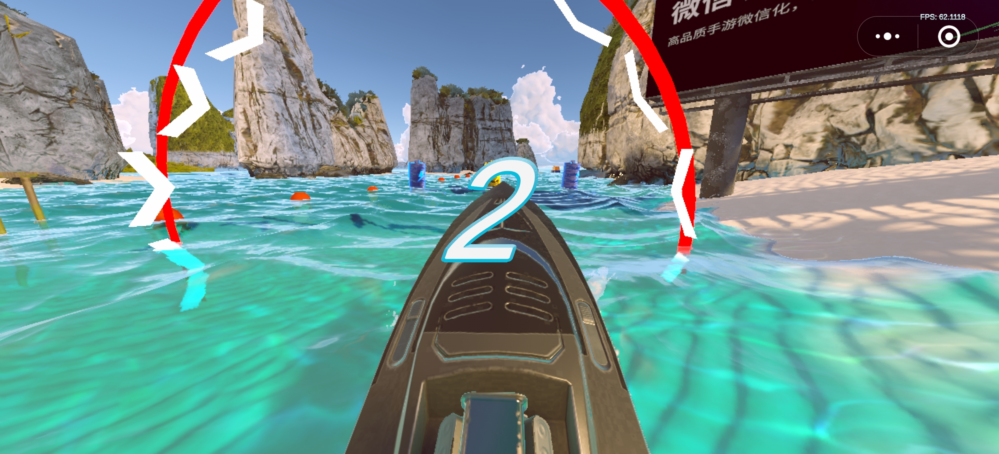

#### boatAttack 修改日志
#####    参考unity官方：[BoatAttck Github](https://github.com/Unity-Technologies/BoatAttack) 

#####    优化修改内容 :
- **水面优化** 
  - **原因**：中端机型上运行时减少卡顿
  - **修改概况** ： 每次进入场景需要bake water depth，换成使用已经bake好的depth贴图
  	- 修改水面反射减少反射pass
	
- **Shader简化**
  - **原因**：中端移动设备渲染有压力
  - **修改概况** ： 
	- 移除植被顶点动画，次表面反射效果
	- 移除物体自发光
	- 简化山体法线计算，自遮挡
	- 减少游戏使用的shader数量
	
- **启动优化**
  - **原因** : 为了缩短下载时间和降低内存使用量，降低内存峰值，配合微信自带的内存要求。
  - **修改概况** 
	- 赛艇预制体资源打包ab，运行时加载按需加载
	- 使用AutoStreaming功能减小首包
	- 简化首场景，因为是固定视角，剔除了不可见的地形和树等物体
	- 首场景使用单独的TMP资产，避免对大字体文件的依赖

- **内存优化**
  - **原因** : 为了缩短下载时间和降低内存使用量，降低内存峰值，配合微信自带的内存要求。
  - **修改概况** 
  	- 调整贴图分辨率，并使用ASTC压缩格式
	- 移除未使用的package
	- 调整模型和纹理的读写属性
	- managed code strip level调整为high， 添加link.xml文件
	- 修改AudioClip导入质量
	
- **GamePlay修改** 
  - **修改概况**：
	- 增加比赛场景，增加赛道提示，赛道空气墙限制
	- 文字和图标的汉化
	- 添加陀螺仪和移动操控方式
	
- **场景修改**
  - **原因**：场景太过复杂导致帧率过低
  - **修改概况**： 修改烘焙阴影参数，简化部分动态效果

#### 打包流程

- **前提要求**
	- 1. 前往[UOS官网](https://uos.unity.cn/),登录后创建新的应用，并点击试用CDN。完成后在设置页面获取到UOS CDN App ID 和 UOS App Service Secret

	- 2. 下载微信开发者工具 
	[微信开发者工具下载地址](https://developers.weixin.qq.com/miniprogram/dev/devtools/stable.html)
	安装完成后，使用微信账号登录后，并申请小游戏appid，注意不是小程序

	- 3. 下载 团结 微信小游戏插件SDK
	下载链接： [minigame.202401191135.unitypackage](https://tla-1312733274.cos.ap-shanghai.myqcloud.com/InstantGame/Release/tuanjie1231/minigame.202401191135.unitypackage)

- **操作** : 
	- 1. 拉取代码  并切换到分支 weixinminigame

	- 2. 安装团结1.0.3或更新的版本（注意同时安装微信小游戏平台 和 WebGLSupport平台），打开工程。

	- 3. 打开页面 Windows->AutoStreaming->Cfg&Publish页面， 填写自己的UOS CDN App ID 和 UOS App Service Secret。点refresh刷新后，新建自己的bucket和 badge.

	- 4. 依次点 Texture Streaming 页面的 Generate AssetBundles, Generate Placeholders

	- 5. 点击Utilities -> Build WXAssetBundles， 生成AB 到目录 AssetBundles\WeixinMiniGame\，同时会自动将AB文件拷贝到CustomCloudAssets，方便上传到UOS CDN

	- 6. 打开微信小游戏打包页面，填写appid, 打包路径等，然后点生成并转换按钮

	- 7. 打包完成后，会自动上传AutoStreaming文件和首包资源文件到UOS CDN, 首次上传cdn后需要半分钟左右，才能访问到所有资源

	- 8. 从微信开发者工具中打开minigame目录, 即可运行

	- 9. 点击预览生成二维码后，使用申请Appid的微信扫码即可在手机上运行

- 详细步骤请参考 团结引擎官方文档[微信小游戏-快速上手](https://docs.unity.cn/cn/tuanjiemanual/Manual/AutoStreamingDemo.html) 章节.

- 当前微信小游戏SDK中使用的brotli路径指向了WebGL目录，因此需要安装WebGLSupport平台

#### 性能测试
- **打包选项**：
	- 微信小游戏转换工具面板：
		- UnityHeap 192MB
		- 勾选 webgl 2.0， il2cpp Optimize Size
	- Editor BuildSettings：
		- Code Optimization： Disk Size

	- 小游戏设置
		- 高性能模式
		- 未开启代码分包

- **测试环境**： 
	- iphone 14 + 风扇降温
	- instruments

- **测试结果：**
	- 首包大小： 11.1MB
		- wasm 4.65MB （br压缩）
		- data 6.5MB （gzip压缩）
	- 启动时间 2.55s
	- fps 54 - 91 均值 70
	- 平均cpu使用率 65%
	- 内存峰值 752MB
